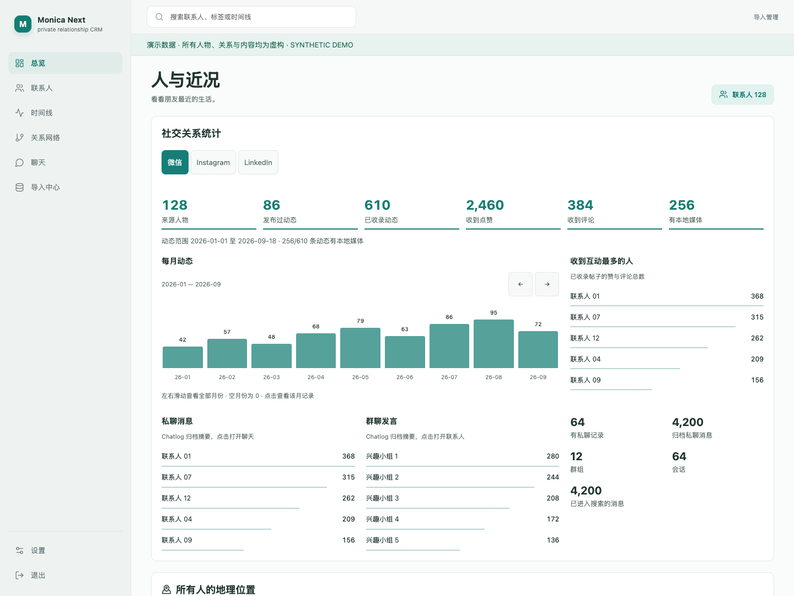
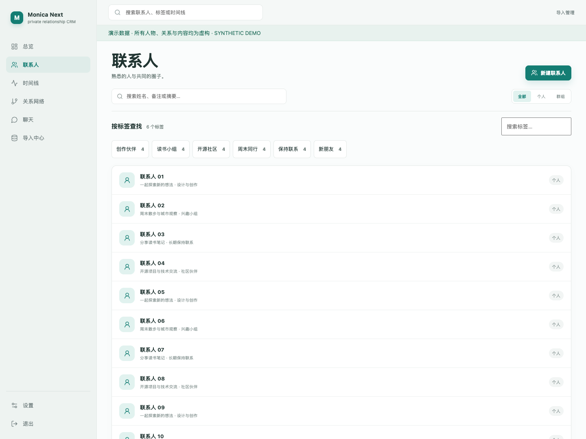
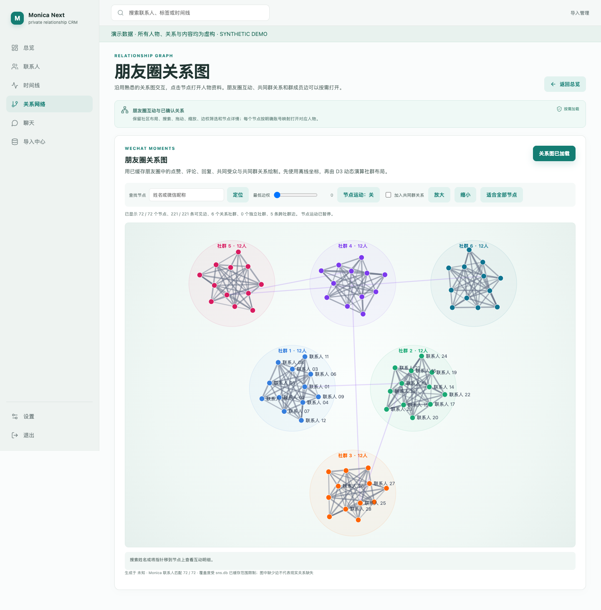
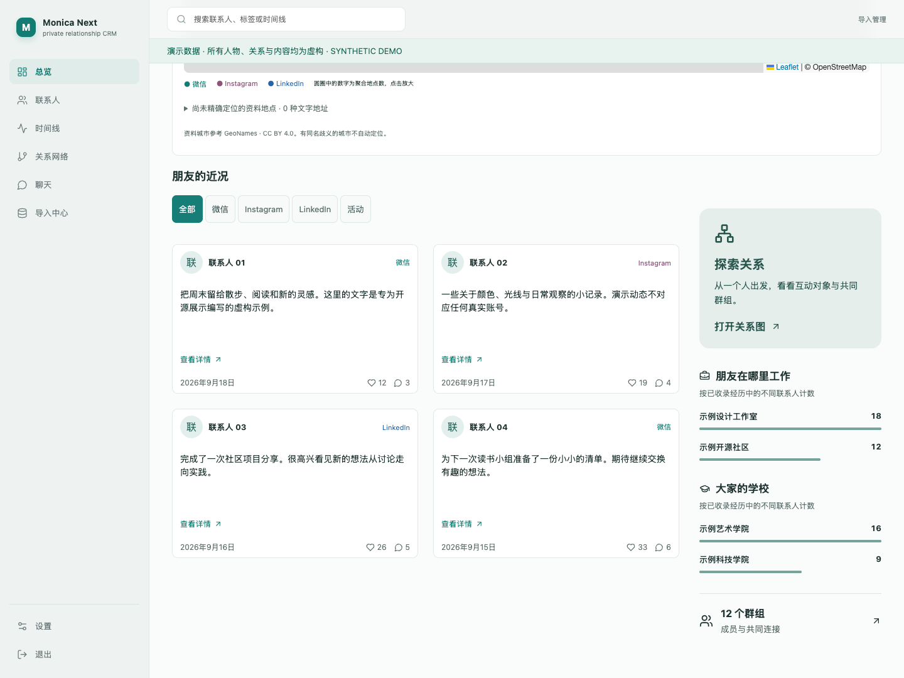

<div align="center">

# Monica Next

**把联系人、社交近况和共同经历，留在自己的服务器上。**

一个可自托管的个人关系管理工具，提供联系人档案、多来源时间线、关系网络和聊天归档浏览。

[English](README.en.md) · [快速开始](#快速开始) · [开发指南](CONTRIBUTING.md) · [安全说明](SECURITY.md)


</div>



> 展示图由项目的真实前端运行生成，全部使用独立构造的虚构数据。人物仅以「联系人 01」等编号显示；不包含真实姓名、头像、聊天、账号、位置或私有部署地址。图中的数量也不代表真实使用数据。

## 可以做什么

- **联系人与群组**：整理简介、标签、工作和教育经历，将不同来源账号关联到同一个档案。
- **来源与历史**：保留字段修订、原始来源和手工编辑；查看数据从哪里来、何时变化。
- **社交时间线**：统一浏览导入的微信、Instagram、LinkedIn 内容、媒体及互动记录。
- **关系网络**：在交互式图中查看朋友圈互动、共同群关系和已确认的连接，支持搜索、缩放和节点定位。
- **统计与地图**：浏览每月动态、互动排行、聊天归档摘要和地点分布。地点来自归档或资料，不是实时定位。
- **聊天归档**：按需查看会话和消息；导入后可检索消息文本。
- **导入与媒体**：增量批次、内容哈希去重、来源游标、签名验证、断点上传和异步处理。
- **自己的数据**：Docker Compose 部署，PostgreSQL 存储结构化数据，原始归档与媒体存放在本机或 NAS。

这是一个持续迭代中的个人项目，当前界面以中文为主。它是独立实现的 CRM，**不是官方 Monica 项目，也不隶属于 Monica 或任何社交平台**。导入器处理你已有且有权使用的归档，不提供第三方账号凭据或自动采集服务。

## 界面预览

### 联系人：标签与关系上下文



### 关系网络：从一个连接开始探索



### 近况：把值得记住的事情放在一起



## 先体验界面

只需要 Node.js 22+，无需数据库、NAS 或第三方账号：

```sh
git clone https://github.com/hmumixaM/monica-next.git
cd monica-next
npm ci
npm run demo
```

打开 **http://127.0.0.1:4310/dashboard**。演示支持总览、联系人筛选、时间线和关系图；联系人详情、导入、聊天和设置不在演示范围内。数据仅存在于演示进程中，写操作被拒绝，不连接生产数据库。按 `Ctrl+C` 停止。

演示页面顶部有明确的虚构数据标记。截图流程与边界见 [展示数据说明](docs/SHOWCASE.md)。

## 快速开始

需要 Docker Engine / Docker Desktop、Docker Compose v2 和 Python 3。完整部署不要求宿主机安装 Node.js。

```sh
git clone https://github.com/hmumixaM/monica-next.git
cd monica-next

# 生成独立数据库密码和签名密钥，不会覆盖已有 .env。
python3 scripts/init-env.py

docker compose --env-file .env -f infra/docker-compose.yml up -d --build
```

首次启动会创建数据库并运行迁移，入口为 **http://localhost:8080**。默认仅监听本机地址。

首次使用前，在本机终端创建唯一的管理员账号。以下交互式命令不会把密码写进命令行或 shell 历史：

```sh
python3 scripts/bootstrap.py
```

然后访问 `/login` 登录。初始化接口在已有账号后会拒绝再次初始化。服务状态与日志：

```sh
docker compose --env-file .env -f infra/docker-compose.yml ps
docker compose --env-file .env -f infra/docker-compose.yml logs --tail=100 api
```

默认数据目录位于 `infra/volumes/data/`，数据库使用 Docker volume。`.env`、数据、备份和运行日志均不属于开源仓库。NAS、HTTPS、备份、恢复和独立开发环境配置见 [部署指南](docs/DEPLOYMENT.md)。

**用于真实数据前**：设置 `APP_ENV=production` 并配置可信 HTTPS，通过 VPN 或受控反向代理访问。先在本机完成管理员初始化，再开放访问。开发模式的 HTTP 配置只用于本机体验。

## 项目结构

```text
apps/web/             Next.js + React + TypeScript 前端、PWA
services/api/         FastAPI API、认证、导入与查询
services/worker/      后台任务与指标刷新
packages/contracts/   TypeScript 数据契约
importers/            WeChat / Instagram / LinkedIn / Monica 归档适配器
migrations/           PostgreSQL 迁移
infra/                Docker Compose、Caddy、备份及运维工具
scripts/              初始化、虚构演示与公开内容检查
docs/                 部署、展示数据与截图
```

浏览器通过同一入口访问 Next.js 和 FastAPI；后台任务处理导入与媒体。字段修订、来源观察记录和当前读取视图分开保存；相同内容通过 SHA-256 去重。具体批次格式和签名提交方式见 [导入器说明](importers/README.md)。

## 隐私与安全边界

- 公开仓库只有代码、通用配置模板、虚构示例和演示截图，拥有独立的 Git 历史。
- 浏览器会话使用 HttpOnly cookie，生产环境设置 Secure；浏览器写请求使用 CSRF 校验。密码采用 Argon2id，支持 TOTP、恢复码和设备会话撤销。
- 导入支持 HMAC、时间戳、nonce 和来源 token。配置值在私有 `.env` 中管理。
- 自托管不意味着没有外部请求：地图会请求 OpenStreetMap 瓦片，媒体导入可能访问来源平台 CDN。公开演示不加载个人媒体；地图瓦片请求仍可能向地图提供者透露访问者 IP 和当前地图区域。
- 不要把真实联系人、日志、消息导出、数据库或带凭据的截图放进 Issue、PR、Actions artifact 或 Git。

当前版本未经独立安全审计。完整报告方式和部署边界见 [SECURITY.md](SECURITY.md)。

## 开发与贡献

欢迎提交可复现问题、文档改进和小范围 PR。请使用虚构数据，先阅读 [CONTRIBUTING.md](CONTRIBUTING.md)。

```sh
npm ci
npm run lint:web
npm run build:web
cd services/api
uv sync --locked
uv run ruff check app tests ../../importers
# 完整测试需要独立、可丢弃的 PostgreSQL，详见开发指南。
```

GitHub Actions 检查 Python、TypeScript、前端构建和 Compose，并构建三个容器镜像。后续方向包括更多公开测试样例、归档格式兼容性和英文界面；没有承诺发布时间。

## 许可与致谢

项目代码以 [MIT License](LICENSE) 发布。随仓库分发的 D3、TopoJSON 和地图资料保留各自许可与署名，见 [THIRD_PARTY_NOTICES.md](THIRD_PARTY_NOTICES.md)。感谢 Next.js、React、FastAPI、PostgreSQL、Leaflet 及其他开源依赖。
